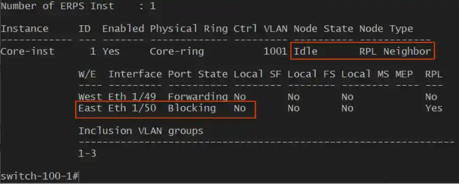

# Generate Edge-Core Switch Configuration Files with VLANs and ERPS

Automate the configuration of Edge-Core ECS4100 series switches with these scripts. The generated configuration files can be quickly uploaded to switches via TFTP, significantly accelerating network deployment times. The configuration includes settings for IP networks, VLAN port assignments (tagged or untagged), and Ethernet Protection Rings (ERPS) for enhanced network reliability. All configuration settings are stored in the `sw_config.py` file.

## Configuration

Customize your settings by editing the `sw_config.py` file. Specify your preferred IP network settings, VLANs, port ranges, and ERPS rings.

### Network config

```python
NETWORK = "192.168.5"
MASK = "255.255.255.0"
MNGT_VLAN = "5"
```

VLAN access ports config per switch number:

```python
SW = {
"100": {
    "vlans": {              # VLAN access ports
        "20": list(range(1,  13)),  # from 1 to 12  - VoIP
        "30": list(range(13, 25)),  # VID 30        - Lab test
        "10": list(range(25, 37)),  # from 25 to 36 - Core
        "5":  list(range(37, 43)),  # from 37 to 42 - Management
    },
    "epsr": ["Core"]        # Add the member 100 to EPSR config as well
    },
}
```

In the example configuration above, switch number 100 has ports 1 to 12 assigned as untagged VLAN 20 ports and is also a member of the ERPS ring named 'Core'.

### VLAN groups names with VLAN IDs

```python
GROUPS = {
    "Main": ["5", "20"],
    "Core": ["10"],
    "c-Main": ["1002"],
    "c-Core": ["1001"],
    "c-A": ["1003"],
    "c-B": ["1004"],
    "c-C": ["1005"]
}
```

### Ethernet Ring Protection switching (ERPS)

The EPRS configuration defines multiple rings. Each switch in the Major ring has two interface ports, `west` and `east`, along with the Ring Protection Link (RPL) owner and a control VLAN. The major ring also includes the control VLANs of all sub-rings.


The sub-rings are connected to the Major ring at one end, where they link to the RPL owner switch through the `west` interface, and at the other end, they connect to the `far-end` switch via the `east` port. These two termination switches in the sub-ring each have only one interface port participating in the sub-ring. The sub-ring is configured to specify the `major-ring` for sending control packets.

```python
EPSR = {
    "Main": {
        "sub-ring": False,
        "name": "Main",
        "id": "2",
        "owner": "101",
        "neighbor": "105",
        "members": ["101", "102", "103", "104", "105"],
        "vlan-groups": ["Main", "Core", "c-Core", "c-Main", "c-A", "c-B", "c-C"],
        "control": "c-Main",
        "west": "51",
        "east": "52",
    },
    "Core": {
        "sub-ring": True,
        "major-ring": "Main",
        "name": "Core",
        "id": "1",
        "members": ["100", "101", "102"],
        "owner": "101",
        "neighbor": "100",
        "far-end": "102",
        "vlan-groups": ["Main", "Core", "c-Core"],
        "control": "c-Core",
        "west": "49",       # west connected to RPL owner by default
        "east": "50",       # east connected to RPL neighbor by default
    },
}
```

## Config generation

### Generate configs for all switches

Generate config files for all configured switches at once:
```sh
python3 gen_config_all.py
```

### Generate config for particular switch

Generate config for switch number `100`:
```sh
python3 ecs_config.py 100
```

As a result, an output file named `sw100.cfg` will be generated in the local directory. By default, the switch will be named 'switch-100' with a management IP address of '192.168.5.100.'

## Switch ERPS instance status

In normal operation, switches are set to the `Idle` state, and no Signal Fail (SL) messages are received. The RPL owner blocks the `west` interface, while the RPL neighbor blocks the `east` interface accordingly.

Core ring RPL owner `switch-101` settings:


Core ring RPL neighbor `switch-100` settings:



These scripts automate Edge-Core ECS4100 switch configurations, enabling fast upload of generated config files and accelerating network deployment with IP settings, VLANs, and ERPS for enhanced reliability.
